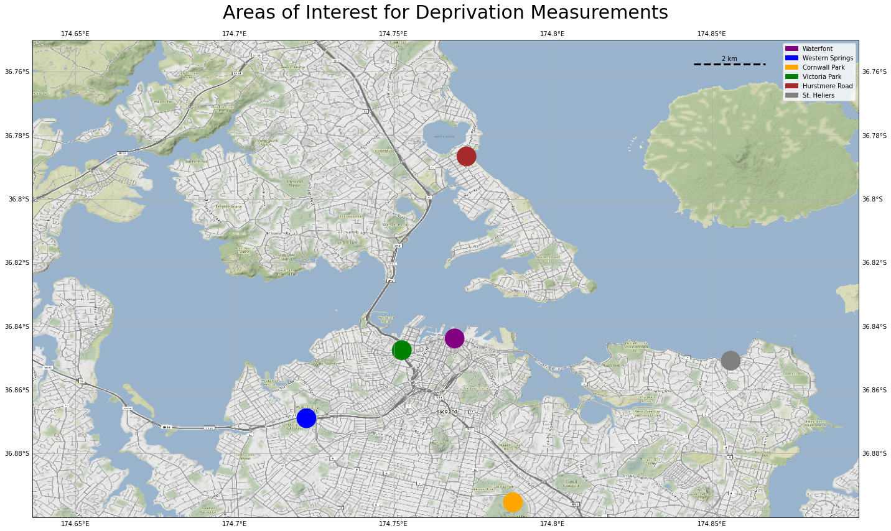
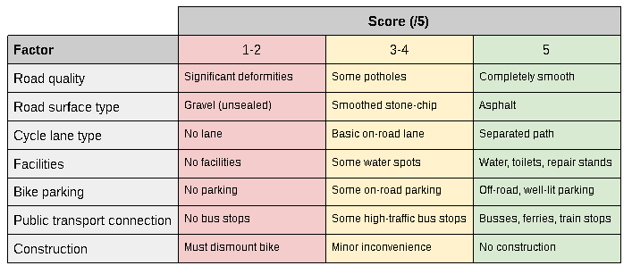
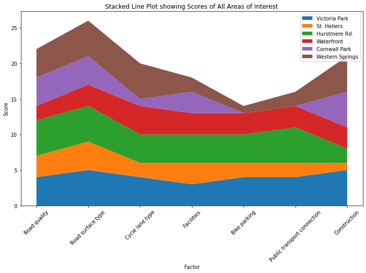
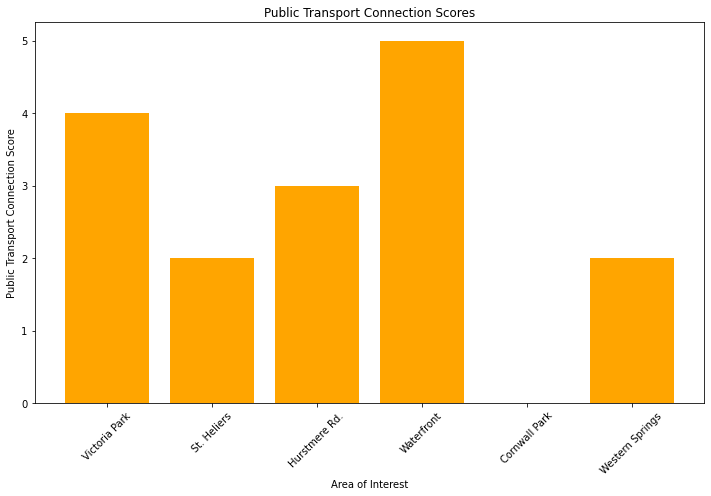
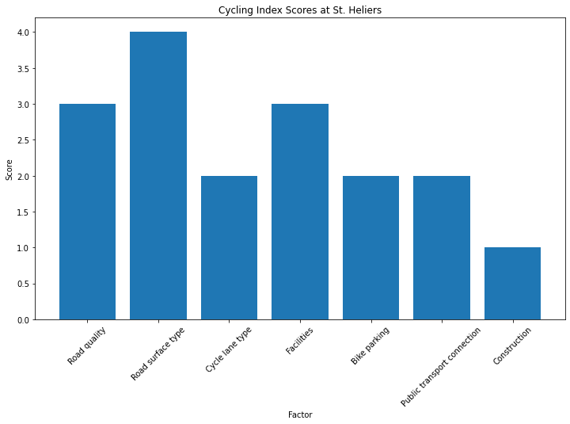
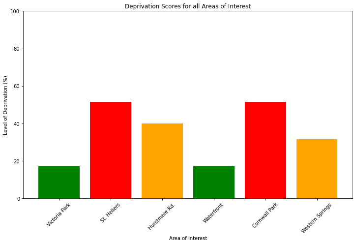

Assignment 2
---
[< Back](https://yozpoz64.github.io/geog342/)

<h2>Introduction</h2>
Active transport is becoming prevalent as an effective form of exercise and climate-friendly alternative to single-occupancy vehicles. Cycling is a particularly practical way of getting around (Rabl & De Nazelle, 2012), as it is fast and cheap making it very accessible. But this accessibility depends on how friendly an area is towards cycling. Some areas have great cycling infrastructure, with safe separated paths and dedicated traffic control. Other areas that have no bike-specific infrastructure, while cycling is possible on roads, may not seem accessible to everyone. So while a local government can encourage cycling and tell us to stop driving until our ears bleed, they more than likely cannot back this up with bike-friendly policies and infrastructure. 

This introduces a need for a measure of how friendly an area is towards cycling. This may encourage people to adopt this active transport if their area is good for cycling. If an area scores poorly for cycle-friendliness, decision-makers could take a hard look at the area and make targeted funding decisions to help those that would make use of it the most. These data-driven decisions would be important, as targeted funding has the potential to improve the lives of potential cyclists due to the physiological, climate, and mental health benefits cycling brings. This would be possible if we had a standard measurement for how bike-friendly an area is so that these decisions can be made fairly, and so that people can make use of cycling infrastructure they might not know is available to them.

The need for data on cycle-friendliness is clear, and I will set to develop a standard measurement defined as cycling deprivation. Deprivation is measured extensively in New Zealand, such as the socioeconemic indexes of the [NZ Index of Multiple Deprivation](http://www.imd.ac.nz/NZIMD_Single_animation_w_logos/atlas.html) (Exeter et al., 2017) and [NZ Deprivation Index](https://www.otago.ac.nz/wellington/departments/publichealth/research/hirp/otago020194.html) (Salmond & Crampton, 2012). I will be drawing from these concepts by using several indicators to create a final index score - in this context, of how friendly an area is towards cycling. This blog post will outline my journey from data collection to the scores of the areas I measured. I will analyse how useful the index is, and how the concept could be applied on a larger scale.

<h2>Data Collection</h2>
Due to the Covid-19 lockdown at the time of writing, I chose to analyze areas that were close to where I lived on the University of Auckland campus. Aside from Takapuna, these areas are within cycling distance. I suffered an injury that left me unable to cycle during measurement, so was only able to collect data in-person for a few of the areas, as is evident on the photos of my final map. Areas that I could not collect data for in-person were assessed using aerial imagery and Google Streetview, which gave a good perspective and judgement as they tools proved to be very effective.

<i>Map 1. Areas of interest for testing the Cycling Index</i>

Map 1 shows the areas that I collected data for to be measured against the index. The areas of interest are roughly 300m segments of road and/or pathways within the suburbs/parks/city centre that were of note. I collected most data in the form of photos, as well as noting my general impressions of each area. This includes getting impressions virtually through Google Streetview. I collated the data into a Python file that was used for all of the analysis. I used exclusively free and open-source tools to convey the re-usability and approachability of my findings. You can access my code, plots and writeups within the [GitHub repository](https://github.com/Yozpoz64/geog342) that this site is being hosted on. 

<h2>Index Description</h2>
<h3>Factors and Weightings</h3>
The cycle-friendliness index was built on factors that I, as a cyclist, determined to be important in how an area is approachable to any cyclist. These factors cover important aspects of cycling, including safety (road quality, surface), critical infrastructure (cycle lanes, facilities, bike parking) and general accessibility (public transport connections, construction). As a cyclist, these factors inform my perception of how an area facilities riding a bike. It is important to quantify these factors so that they can be calculated as an index.

<i>Table 1. Index factors and some guideline scores</i>

Table 1 gives example scores for the factors of the index. Here you can see that lower scores describe poor conditions, while higher scores describe good conditions. This is consistent across all factors so that they can be quantified and combined easily.

The weighting of factors in an index is an important consideration. I could apply weighting to each factor, similar to a GIS multi-criteria evaluation where the importance of each factor in the index is compared in the final calculation. Different weighting approaches will result in different scores for each area, such as in the German Index of Multiple Deprivation where it was found that weightings changed the output mortality rates (Schederecker et al., 2019). Weightings are often normalized and calculated with statistical techniques such as regression (Decancq & Lugo, 2008). I have chosen to apply no weightings to my index for a few reasons. Firstly, normalisation or other techniques are not necessary in the first place as all factors are measured on numerically-identical 1 to 5 scale. Secondly, I envisioned these factors as being of equal importance towards the friendliness an area has towards cycling. If one was to look at my source code and decide that they believed road quality was more important of a factor than cycle lane quality, they could apply a simple multiplier weighting. For the purposes of this report, where the study will focus on my perspective of an area, no weighting will be applied as I believe all factors to be identical in importance.

<h3>Examples of Indexed Areas</h3>
After establishing factors, collecting the data (perceiving then quantifying), I was ready to build the index around the areas of interest. These areas proved to have an interesting range of scores on the index, which allowed me to critically analyse the effectiveness of the index at describing small- and large-scale variation.

<i>Figure 1. Stacked line plot showing the index scores of all areas of interest</i>

The scores of each factor for all locations is plotted in Figure 1. Here we can see that scores were generally quite uniform for road surface type and quality. Other factors varied significantly based on the area, such as construction and public transport connection. Note that this is the individual scoring of factors, not the final deprivation score (see Figure 5 for the final deprivation percentages).

<i>Figure 2. Public transport connection index scores all areas of interest</i>

Public transport connection scores for all areas is plotted in Figure 2 to show the variation of an individual factor. Here we can see that the area of Cornwall Park, which is isolated from public transport connections as it is pedestrianised, scores very poorly. The Waterfront does very well as it is lined with bus stops and is adjacent to a bustling ferry terminal. 

As well as looking at individual factors spatially, we can look at the overall scoring of areas of interest to determine their complete cycle-friendliness, according to the index. As an example, let's look at St. Heliers, an affluent suburb along Auckland's Eastern shoreline. 

<i>Figure 3. Index scores for St. Heliers</i>

<i>Figure 4. Photos taken at St. Heliers town</i>

Figure 3 plots the scores that St. Heliers achieved for cycle-friendliness. here we can see that road quality, surface and facilities score well, likely due to the fact that the area has very low socio-economic deprivation and thus good access to facilities and infrastructure development (Terruhn, 2021). When I visited, the area was undergoing significant construction, such that there was signage instruction riders to dismount their bikes (see Figure 4). This indicates a strong preference of motor vehicle transport over cycling for this neighbourhood. 

Overall, St. Heliers scored 29/35 or 83%. This equates to the area being 17% deprived (100% - 83%) on the cycling-friendliness index. This appears to be a low level of deprivation, although we can only truly see this when comparing to the other areas of interest.

<i>Figure 5. Deprivation scores (%) of all areas of interest</i>

All deprivation scores of areas of interest are plotted on Figure 5. This is the final combined measure, and we can see that none of the areas are extremely deprived.

<iframe scrolling="no" src="https://yozpoz64.github.io/geog342/assignment2/index.html" width="100%" height="600px"></iframe>

<i>Map 2. Bike-friendliness of certain areas, with photos (this map is interactive, try panning around)</i>

Map 2 shows the scores each area achieved, as well as photos taken in areas I was able to collect data first-hand. Note that the images can take a bit to load. Road segments representing the areas are coloured based on their scores (warmer colours = lower). This system increases the accessibility of the algorithm as anyone can load up this map on a web-enabled device and see how friendly a measured area is towards cycling. 

<h2>Algorithm Perception</h2>
Perception of the created algorithm: who is this method for, how inclusive isit,is  it  comparable  to  the  official  index,what  are  the  space  power  relations that you can comment on? 

<h2>Conclusion</h2>
talk about applying the concept on a larger scale

<b>Word Count: </b> 1526

<h2>References</h2>

Decancq, K., & Lugo, M. A. (2008). Settings weights in multidimensional indices of well-being and deprivation.

Exeter, D. J., Zhao, J., Crengle, S., Lee, A., & Browne, M. (2017). The New Zealand Indices of Multiple Deprivation (IMD): A new suite of indicators for social and health research in Aotearoa, New Zealand. PloS one, 12(8), e0181260.

Rabl, A., & De Nazelle, A. (2012). Benefits of shift from car to active transport. Transport policy, 19(1), 121-131.

Salmond, C. E., & Crampton, P. (2012). Development of New Zealand's deprivation index (NZDep) and its uptake as a national policy tool. Canadian journal of public health/Revue Canadienne de sante'e publique, S7-S11.

Schederecker, F., Kurz, C., Fairburn, J., & Maier, W. (2019). Do alternative weighting approaches for an Index of Multiple Deprivation change the association with mortality? A sensitivity analysis from Germany. BMJ open, 9(8), e028553.

Terruhn, J. (2020). Urban diversity and inequality in Auckland. In Intersections of Inequality, Migration and Diversification (pp. 131-151). Palgrave Pivot, Cham.
